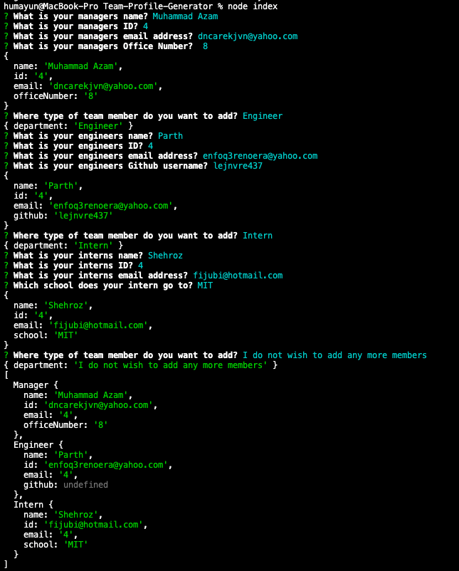
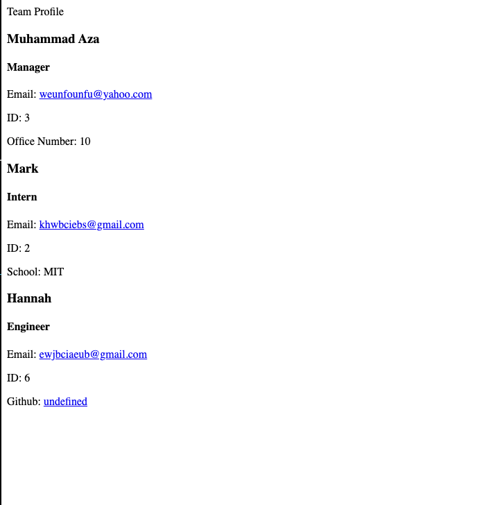

# Team-Profile-Generator

* I created this Team Profile Application using Object Oriented Programming(OOP) and Test-Driven Development (TDD). I also used Node.js and inquirer package to prompt all the questions for the user to answer and following that it will generate an HTML template with each individual roles and details.

# ScreenShots

# Walkthrough Video Link

* https://drive.google.com/file/d/1pgq4t1H0vEIFRmMPWulFmsOnvVmw4Nis/view